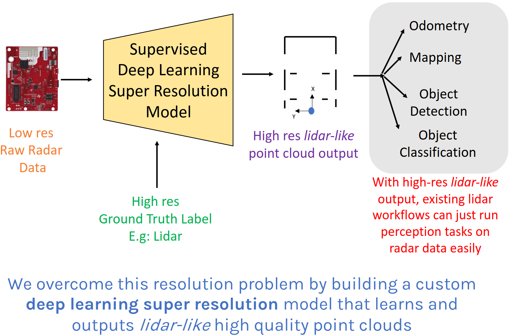

RadarHD creates high resolution *lidar-like point clouds* from just a single-chip, cheap mmWave radar. This enables high quality perception even in vision/lidar denied scenarios such as in smoke or fog. For example: think of a futuristic fire fighting robot performing search and rescue in a smoky environment. This repository hosts files pertaining to this project that appeared in IEEE ICRA 2023. 

[Paper link](https://akarsh-prabhakara.github.io/files/radarhd-icra23.pdf) |
[Demo link](https://www.youtube.com/watch?v=me8ozpgyy0M) |
[Project website](https://akarsh-prabhakara.github.io/projects/radarhd/)

# RadarHD Overview

  

# Pre-requisites

- Install [Docker](https://docs.docker.com/engine/install/ubuntu/).
- Clone this repository at `project_root`.
- Download [pre-trained model](https://drive.google.com/file/d/1JorZEkDCIcQDSaMAabvkQX4scvwj0wzn/view?usp=sharing). Move this to [`logs/13_1_20220320-034822/`](./logs/13_1_20220320-034822/) folder.
- [Optional] Download the raw radar and lidar [dataset](). [`dataset_5`](./dataset_5/) contains a processed version of this raw dataset to help users train and test quickly. 
- Matlab (Only for point cloud error evaluation).

# Repository structure

- [`install.sh`](./install.sh) installs all dependencies.
- [`train_radarhd.py`](./train_radarhd.py) and [`test_radarhd.py`](./test_radarhd.py) are used for training and testing our models. 
- Pre-trained model is stored in [`logs/13_1_20220320-034822/`](./logs/13_1_20220320-034822/). This model was trained using radar-lidar images dataset in [`dataset_5/`](./dataset_5/). 
- [`train_test_utils/`](./train_test_utils/) contains model, loss and dataloading definitions for training and testing.
- [`eval/`](./eval/) contains scripts for evaluating RadarHD's generated upsampled radar images.
- [`create_dataset/`](./create_dataset/) contains scripts that show our pre-ML radar and lidar processing on raw sensor data. Use this only for creating your own radar-lidar images dataset (similar to [`dataset_5`](./dataset_5/)) to train with our models.

# Usage

- Create a Docker environment  

        sudo docker run -it --rm --gpus all --shm-size 8G -v project_root:/radarhd/ pytorch/pytorch bash

- Install all dependencies  

        cd /radarhd/
        sh install.sh

- For testing on pre-trained model [`logs/13_1_20220320-034822/`](./logs/13_1_20220320-034822/) and test images in [`dataset_5/test/`](./dataset_5/test/)  

        python3 test_radarhd.py
    
    - For testing with other models and datasets, modify the constants in [`test_radarhd.py`](./test_radarhd.py).
    - To test on CPU, make sure to use CPU device.

- For training using params similar to [`logs/13_1_20220320-034822/`](./logs/13_1_20220320-034822/) and train images in [`dataset_5/train/`](./dataset_5/train/)  

        python3 train_radarhd.py

    - For training with your own params and datasets, modify the constants in [`train_radarhd.py`](./train_radarhd.py)

- For evaluating the output of  [`test_radarhd.py`](./test_radarhd.py):

    - Executing [`test_radahd.py`](./test_radarhd.py) will create generated upsampled radar and ground truth lidar images in polar format for all the test data in the corresponding log folder. (Default: [`logs/13_1_20220320-034822/test_imgs/`](./logs/13_1_20220320-034822/test_imgs/))
    - Convert polar images to cartesian.

            cd ./eval/
            python3 pol_to_cart.py
    
    - Convert cartesian images to point cloud for point cloud error evaluation.

            python3 image_to_pcd.py

    -  Visualize the generated point clouds for qualitative comparison in Matlab.

            pc_vizualize.m

    - Generate quantitative point cloud comparison in Matlab (similar to [`eval/cdf.jpg`](./eval/cdf.jpg))

            pc_compare.m

# Citation

If you found this work useful, please consider citing this work as:

    @INPROCEEDINGS{10161429,
    author={Prabhakara, Akarsh and Jin, Tao and Das, Arnav and Bhatt, Gantavya and Kumari, Lilly and Soltanaghai, Elahe and Bilmes, Jeff and Kumar, Swarun and Rowe, Anthony},
    booktitle={2023 IEEE International Conference on Robotics and Automation (ICRA)}, 
    title={High Resolution Point Clouds from mmWave Radar}, 
    year={2023},
    volume={},
    number={},
    pages={4135-4142},
    doi={10.1109/ICRA48891.2023.10161429}}

